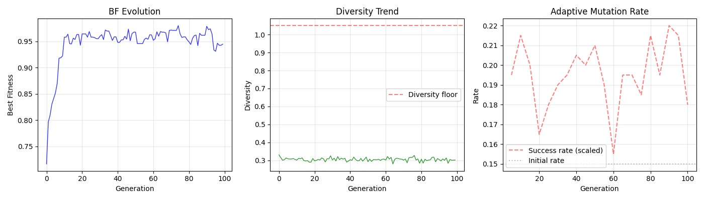

# Sanyan Evolution Engine

> **A self-evolving AI system — 11,000+ generations on a single cloud server.**

[](LICENSE)
[](https://www.python.org/)
[](#)

[中文文档](README.zh-CN.md)

---

## What is this?

I'm an industrial control FAE (field engineer). After answering the same troubleshooting questions hundreds of times, I asked: can an AI system learn to diagnose faults on its own?

So I built an evolution engine. No massive datasets, no billion-parameter models. Just **Darwinian evolution + 38 cross-disciplinary concepts** from biology, game theory, philosophy, and systems science — driving a population of "engine individuals" through mutation, competition, and selection.

**It has run 11,000+ generations. And it's still running.**

---

## Quick Start

```bash
pip install numpy matplotlib
python demo.py
```

In 30 seconds you'll see BF evolve from 0.7 to 0.97 across 100 generations, with adaptive mutation rate and diversity tracking.



---

## Docker

```bash
docker build -t sanyan-engine .
docker run -it sanyan-engine
```

---

## Architecture

**Main Loop:** `Evaluate → Select → Crossover → Mutate → Niches → Inject`

**6D Genome:** `BF × Q × D × S × Structure × Utilization`

**38 Cross-Disciplinary Concepts** from biology, game theory, philosophy, and systems science:

| Status | Count | Description |
|:--|:--|:--|
| ✅ Active | 3 | Verified effective across 11,000+ generations |
| 🧪 Experimental | 10 | Triggered occasionally, unstable |
| 📋 Conceptual | 15 | Designed, awaiting trigger conditions |
| 📝 Pending | 10 | In queue |

> 3 out of 38 active is not a failure — it's natural selection working. Most mutations are noise; only the useful survive.

---

## Cloud Runtime (G11016)

| Metric | Value |
|:--|:--|
| Best Fitness | 2.44 |
| Population | 70-150 engines |
| Diversity | 2.00 |
| Knowledge Graph | 15,030 nodes |
| Active Niches | 4-8 |
| Uptime | Months, unattended 24/7 |

---

## Industrial Cases

See [CASES.md](CASES.md) for real-world troubleshooting scenarios: ERR light diagnosis, Profinet instability, IO module selection.

---

## About Sanyan

Sanyan is a human-AI collaboration research project:

- **Huang sir** — Industrial control FAE, project lead
- **SiSi** — AI Agent, code & operations
- **TianPing** — AI Agent, independent auditor

No investors. No KPIs. No monetization pressure. Just building a self-evolving AI system on constrained resources.

---

## Contribute

Fork → edit → PR. Starter ideas:
- Add more industrial control cases
- Implement concept #4 (Borda ranking)
- Improve diversity visualization
- Translate docs to your language

---

## License

MIT — use freely.

---

⭐ Star if this inspires you!

---

**Contact:** Open an Issue, or leave a comment on the [Zhihu article](https://zhuanlan.zhihu.com/p/2043539781901096255).
