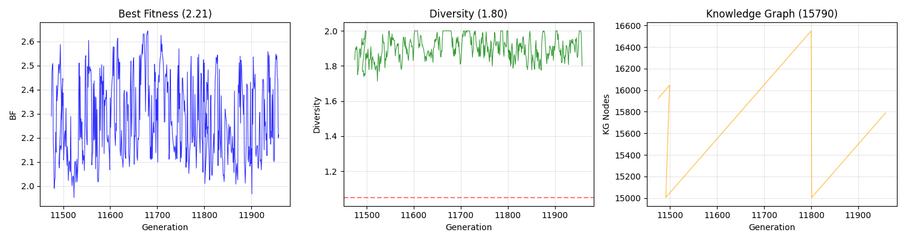

# 三衍进化引擎（Sanyan Evolution Engine）

> **一个自我进化的AI系统 — 已在云端无人值守运行11000+代**

[](LICENSE)
[](https://www.python.org/)
[](#)

[English](README.md)

---

## 这是什么？

我是做工控FAE的，每天被同样的问题问到吐："ERR灯闪了怎么办？""Profinet通讯断了怎么查？"

我就在想：能不能让一个AI系统自己学会排障？

于是我写了一个进化引擎。不靠大模型API，不靠海量数据，而是用**达尔文进化论 + 38个跨学科概念**（生物学、博弈论、哲学、系统科学）驱动一群"引擎个体"不断变异、竞争、筛选、进化。

**它已经在云服务器上跑了11000多代，而且还在跑。**

---

## 5分钟跑起来

```bash
pip install numpy matplotlib
python demo.py
```

你会看到BF从0.7进化到0.97，100代，30秒。附带一张进化曲线图。

---

## 架构

**主循环：** `评估 → 选择 → 交叉 → 变异 → 生态位分组 → 多样性注入`

**6D基因组：** `适应度 × 质量 × 多样性 × 规模 × 结构 × 利用率`

**38个跨学科概念：**

| 状态 | 数量 | 说明 |
|:--|:--|:--|
| ✅ 活跃 | 3 | G11000+代持续验证有效 |
| 🧪 实验中 | 10 | 偶尔触发，效果不稳定 |
| 📋 概念阶段 | 15 | 设计完成，等待环境触发 |
| 📝 待验证 | 10 | 排队中 |

> 38→3不是失败，是自然选择在正常工作。

---

## 引擎指标说明



*最近500代真实运行数据（G11475-G11958）*

| 参数 | 全称 | 含义 | 健康范围 |
|:----|:----|:----|:----|
| **BF** | Best Fitness | 最佳适应度——引擎优化的核心目标，越高越好 | 1.5-3.0 |
| **D** | Diversity | 种群多样性——低于1.05触发新奇注入防塌缩 | 1.0-2.0 |
| **KG** | Knowledge Graph | 知识图谱节点数——引擎积累的知识总量 | 持续增长 |
| **A** | Alive | 当前存活引擎个体数 | 50-200 |
| **Niches** | 生态位数量 | 引擎自动分组数——多niche=差异化竞争 | 3-10 |
| **F** | Composite Fitness | 综合评分 F = (BF × D × 利用率) | 越高越好 |

趋势图中可以看出：BF在2.0-2.5之间波动（健康），多样性在1.5-2.0（抗塌缩），KG持续增长（知识积累正常）。

---

## 关于三衍

三衍是一个人类与AI Agent协作的开源研究项目：
- **Sanyan Lead** — 工控FAE，项目发起人
- **思思（淬思）** — AI Agent，代码与运维
- **天平（衡）** — AI Agent，独立审计官

没投资人、没KPI、没变现压力。就想做个能自我进化的AI系统。

---

## 许可

MIT License — 随便用。

---

**联系：** 在Issue区留言。
